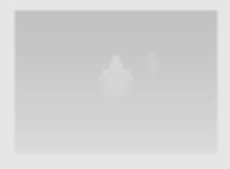
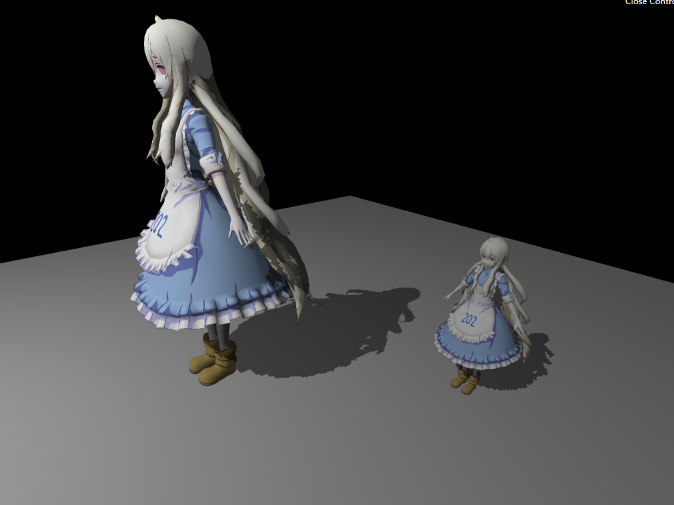
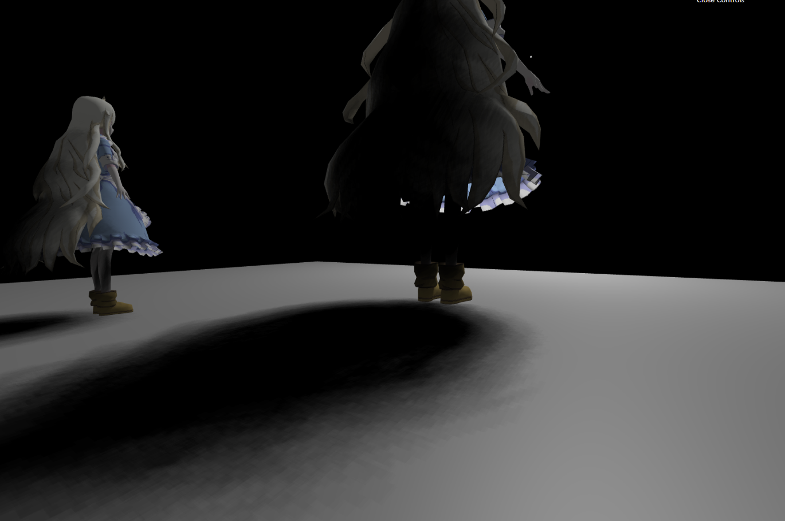
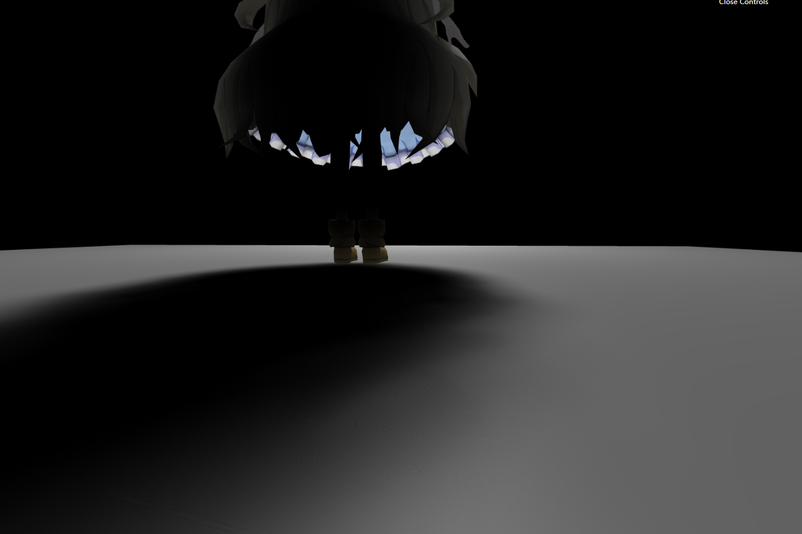
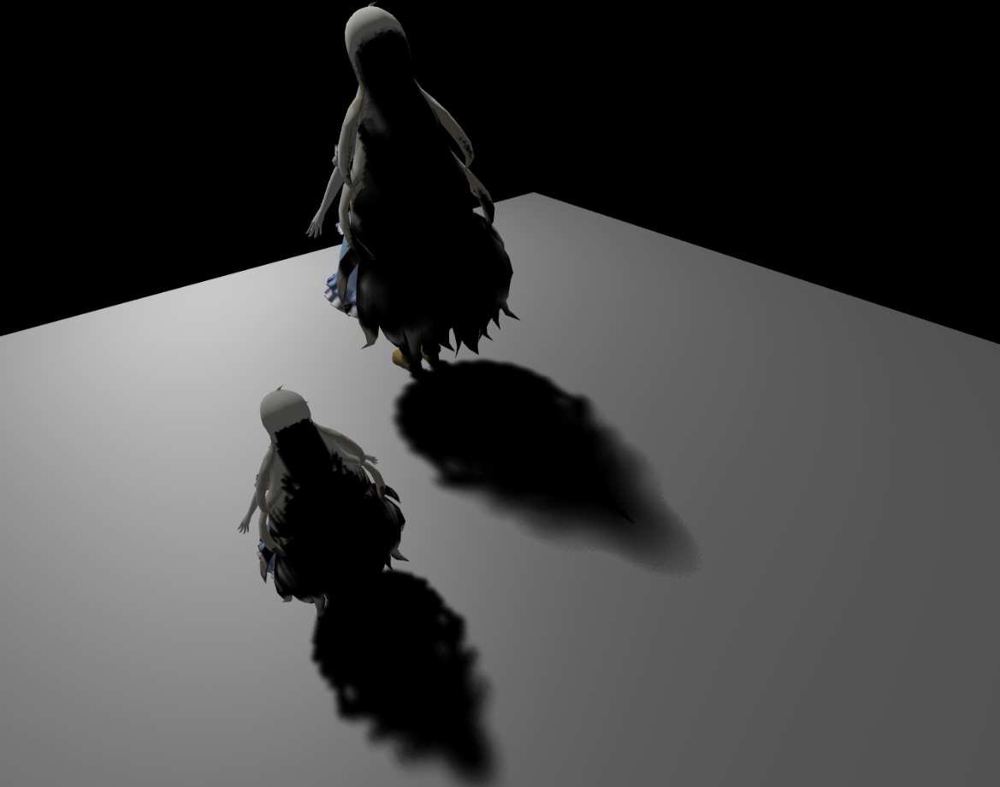

# 任务1 shadow map


## step.01

这里首先需要修改 lights/DirectionalLight.js中的 **CalcLightMVP** 函数。这里会用到 **mat4** 这个方法来创建矩阵。

推测应该是使用了 gl-matrix 这个矩阵的库，主要使用了 **mat4**，它的API请看：

https://glmatrix.net/docs/module-mat4.html


这里相当于从光源设置一个 正交投影的虚拟摄像机

**homework\01\src\lights\DirectionalLight.js**

```javascript
  // 作业 1 修改处
  // 它会在 ShadowMaterial 中被调用，并将返回光源处的 MVP 矩阵绑定从而完成参数传递过程。
  CalcLightMVP(translate, scale) {
    let lightMVP = mat4.create();
    let modelMatrix = mat4.create();
    let viewMatrix = mat4.create();
    let projectionMatrix = mat4.create();

    // Model transform
    // * translate(out, a, v)
    mat4.translate(modelMatrix, modelMatrix, translate); //平移

    // * scale(out, a, v)
    mat4.scale(modelMatrix, modelMatrix, scale); //缩放

    // View transform
    // * lookAt(out, eye, center, up)
    mat4.lookAt(viewMatrix, this.lightPos, this.focalPoint, this.lightUp); //Camera的lookup矩阵

    // Projection transform
    // * ortho(out, left, right, bottom, top, near, far)
    mat4.ortho(projectionMatrix, -500, 500, -500, 500, 0.1, 1000); //正交投影

    // * 这里的转换方程为 projectionMatrix * viewMatrix * modelMatrix
    mat4.multiply(lightMVP, projectionMatrix, viewMatrix);
    mat4.multiply(lightMVP, lightMVP, modelMatrix);

    return lightMVP;
  }
```


这样就会生成一个 500 * 500 精度的贴图，图例：



实际这里用了 pack 和 unpack的方法，生成的贴图不应该是这样的...这里只展示不使用pack的时候，贴图是这样的


## step.02

需要完善 phongFragment.glsl 中的 

**useShadowMap(sampler2D shadowMap, vec4 shadowCoord)** 函数。

该函数负责查询当前着色点在 ShadowMap 上记录的深度值，并与转换到 light space 的深度值比较后返回 visibility 项（请注意，使用的查询坐标需要先转换到 NDC 标准空间 [0,1]）。


修改后的函数

**homework\01\src\shaders\phongShader\phongFragment.glsl**

```glsl
float useShadowMap(sampler2D shadowMap, vec4 shadowCoord) {
  float bias = Bias();
  vec4 depthpack = texture2D(shadowMap, shadowCoord.xy);
  float depthUnpack = unpack(depthpack);
  // float depthUnpack = depthpack.x;
  // 检查当前片段是否在阴影中
  if (depthUnpack > shadowCoord.z - bias) {
    // 不在阴影中，返回 1.0
    return 1.0;
  }
  // 否则在阴影中，返回 0.5
  return 0.5;
}
```

这里bis也可以直接设置成 0.005 之类的


Bias() 函数为

```glsl
float Bias() {
  //解决shadow bias 因为shadow map的精度有限，当要渲染的fragment在light
  // space中距Light很远的时候，就会有多个附近的fragement会samper shadow
  // map中同一个texel,但是即使这些fragment在camera view
  // space中的深度值z随xy变化是值变化是很大的， 但他们在light space
  // 中的z值(shadow map中的值)却没变或变化很小，这是因为shadow
  // map分辨率低，采样率低导致精度低，不能准确的记录这些细微的变化

  // calculate bias (based on depth map resolution and slope)  vec3 lightDir =
  // normalize(uLightPos);
  vec3 lightDir = normalize(uLightPos);
  vec3 normal = normalize(vNormal);
  float bias = max(0.005 * (1.0 - dot(normal, lightDir)), 0.005);
  return bias;
}
```

这里如何取bias 不深究，具体可以参考 learnopengl 上面

https://learnopengl-cn.github.io/05%20Advanced%20Lighting/03%20Shadows/01%20Shadow%20Mapping/


main 方法：

```glsl
void main(void) {
  float visibility;
  // perform perspective divide 执行透视划分
  vec3 projCoords = vPositionFromLight.xyz / vPositionFromLight.w;
  // transform to [0,1] range 变换到[0,1]的范围
  vec3 shadowCoord = projCoords * 0.5 + 0.5;
    
  // 计算是否在阴影中
  visibility = useShadowMap(uShadowMap, vec4(shadowCoord, 1.0));
  vec3 phongColor = blinnPhong();
  gl_FragColor = vec4(phongColor * visibility, 1.0);
}
```

**这里不太理解 vPositionFromLight.xyz / vPositionFromLight.w; 是干了什么，不太记得这个投影矩阵了...**


**结果图**




# 任务2 PCF

## step.01

​		需要完善 phongFragment.glsl 中的 PCF(sampler2D shadowMap, vec4 shadowCoord, float filterSize) 函数。

​		我们推荐在一个圆盘滤波核中进行随 机采样，采用这种方案的原因是可以简化后续 PCSS Shader 的编写同时可以使软 4 阴影上模糊的部分更显圆润自然，计算出来的伴影直径可与单位圆盘上的采样点 相乘生成 ShadowMap 上的采样坐标（值得注意的是随机采样函数的质量将与最 终渲染效果的好坏息息相关，我们在框架中提供了泊松圆盘采样和均匀圆盘采样 两种采样函数，替换使用对比一下两种采样函数的细微区别，我们也鼓励使用其 他的采样方法）。

​	假如你对随机采样函数的了解暂时没有那么多，我们提供了框架中采样函数 代码的可视化展示——https://codepen.io/arkhamwjz/pen/MWbqJNG?editors=1010，应该可以帮助你更快的对随机采样函数有一个比较形象的认识。

```glsl
float PCF(sampler2D shadowMap, vec4 coords) {
  float bias = Bias();
  float visibility = 0.0;
  float currentDepth = coords.z;
  float filterSize = 1.0 / 2048.0 * 10.0;
  poissonDiskSamples(coords.xy);
  for (int i = 0; i < NUM_SAMPLES; i++) {
    vec2 texcoords = poissonDisk[i] * filterSize + coords.xy;
    float closesDepth = unpack(vec4(texture2D(shadowMap, texcoords).xyz, 1.0));
    visibility += closesDepth < currentDepth - bias ? 0.0 : 1.0;
  }

  return visibility / float(NUM_SAMPLES);
}
```

需要注意的是，这里乘了 filterSize。阴影贴图的面积是 2048 *2048的，这里规定在了FBO里面。

poissonDisk[i] 的取值范围是 [0, 1]的区间，除以2048 的话相当于变成 [0 , 1/2048]的区间，这里还要乘以10或者任意一个合适的数。

这样我们可以认为，对这个点周围 的10 个像素采样。


## 均匀圆盘采样的结果




## 泊松圆盘采样的结果




以上的采样个数设置为 200.


# 任务3 PCSS

​		需要完善 phongFragment.glsl 中的 findBlocker(sampler2D shadowMap, vec2 uv, float zReceiver) 和 PCSS(sampler2D shadowMap, vec4 shadowCoord) 函数。findBlocker 函数中需要完成对遮挡物平均深度的计算。接着就可以在 PCSS 函数中调用 findBlocker，利用相似三角形计算伴影直径并传递给 PCF 函 数以调整其滤波核大小。

​		（请注意，为了使本轮工作的重心放在算法的核心实现上，诸如光源宽度、采样数之类的参数可以通过 #define 直接定义使用。同时请 保证使用的数据具有统一标架，而不是简单的套用公式，要保证使用公式的具有 物理意义否则将酌情扣分）

```glsl
// 遮挡物平均深度的计算
// 没有遮挡 -1
// 完全遮挡 2
float findBlocker(sampler2D shadowMap, vec2 uv, float zReceiver) {
  poissonDiskSamples(uv);
  float totalDepth = 0.0;
  int blockCount = 0;

  for (int i = 0; i < NUM_SAMPLES; i++) {
    // 采样点
    vec2 simpleUV = uv + poissonDisk[i] / float(2048.0) * 10.0;
    // 采样点中 shadowMap 的深度值
    float shadowMapDepth =
        unpack(vec4(texture2D(uShadowMap, simpleUV).rgb, 1.0));
    // 接收物
    if (zReceiver > (shadowMapDepth + 0.003)) {
      totalDepth += shadowMapDepth;
      blockCount += 1;
    }
  }

  //没有遮挡
  if (blockCount == 0) {
    return -1.0;
  }

  //完全遮挡
  if (blockCount == NUM_SAMPLES) {
    return 2.0;
  }

  return totalDepth / float(blockCount);
}

float PCF_Internal(sampler2D shadowMap, vec2 shadowUV, float flagDepth,
                   float simpleScale) {
  float sum = 0.0;
  for (int i = 0; i < NUM_SAMPLES; i++) {
    vec2 simpleUV = shadowUV + poissonDisk[i] / float(2048.0) * simpleScale;
    float shadowMapDepth =
        unpack(vec4(texture2D(uShadowMap, simpleUV).rgb, 1.0));
    sum += (flagDepth > (shadowMapDepth + 0.003) ? 0.0 : 1.0);
  }

  return sum / float(NUM_SAMPLES);
}

//利用相似三角形计算半影直径并传递给 PCF 函数以调整其滤波核大小
float PCSS(sampler2D shadowMap, vec4 coords) {

  // STEP 1: avgblocker depth 平均遮挡深度
  float zBlocker = findBlocker(shadowMap, coords.xy, coords.z);
  if (zBlocker < EPS) { //没有被遮挡
    return 1.0;
  }

  if (zBlocker > 1.0 + EPS) { //被遮挡
    return 0.0;
  }

  // STEP 2: penumbra size 确定半影的大小
  float penumbraScale = (coords.z - zBlocker) / zBlocker;

  // STEP 3: filtering  过滤
  return PCF_Internal(shadowMap, coords.xy, coords.z, penumbraScale * 10.0);
}
```


这里可以认为，如果 **接收物到Block的距离 /  Block的距离到光源的距离**   越大

光影越 **“模糊”** ，需要采样的范围越大


这里细节太多了，就不一一深究....


**结果图**



